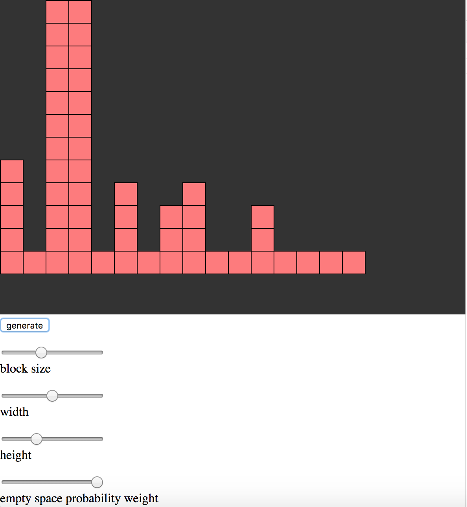
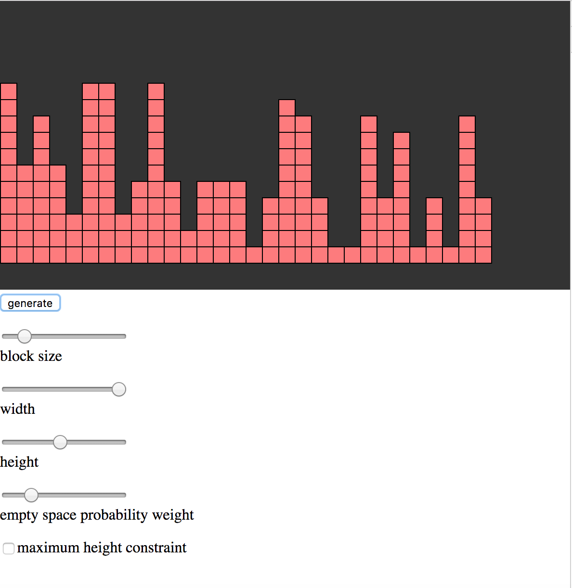

# CastleBuilder
A castle builder algorithm in Javascript.

Inspired by [the problem 502 of Project Euler][prob] this program generates a random "castle".

## An example castle

## More functionality

When the maximum height constraint is unchecked CastleBuilder generates images what looks like city skylines.

[//]: #

   [prob]: <https://projecteuler.net/problem=502>
